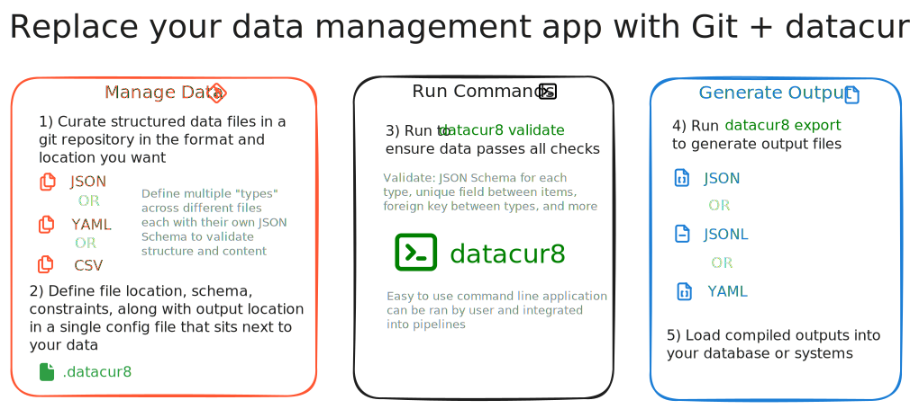

# datacur8
{: .no_toc }

## Table of contents
{: .no_toc .text-delta }

1. TOC
{:toc}

## What is datacur8?

datacur8 is a config-driven command-line tool that validates, exports, and tidies structured data files (JSON, YAML, and CSV) stored in a repository. It brings database-level data integrity to file-based datasets managed in git.

**The problem:** Teams often manage configuration, catalog, or reference data as files in a git repository. Without tooling, there is no way to enforce schemas, uniqueness, foreign key relationships, or naming conventions. Errors accumulate silently until they cause production incidents.

**The solution:** datacur8 reads a single `.datacur8` configuration file that declares your data types, schemas, and constraints. It validates every file deterministically, produces clear error messages, and runs identically locally and in CI.



## Key Features

- **JSON Schema validation** — validate every data file against an inline JSON Schema with full-featured support via `google/jsonschema-go`
- **Cross-file constraints** — enforce uniqueness, foreign keys, and path-to-attribute rules across files and types
- **Export** — compile validated data into deterministic JSON, YAML, or JSONL output files
- **Tidy** — normalize formatting (sorted keys, stable ordering) for clean diffs
- **Strict mode** — optionally enforce `additionalProperties: false` on all object schemas
- **CSV support** — schema-guided type conversion with header validation
- **Git-friendly** — designed for CI pipelines; identical results locally and in automation

## Quick Start

1. Create a `.datacur8` file in your repository root:

   ```yaml
   version: "0.0.1" # Minimum version of datacur8 required for this config
   types:
     # Defines the type of 'team' to manage data
     - name: team
       input: yaml
       match:
         include:
           # Specify where the files are located
           - "^teams/.*\\.ya?ml$"
       # JSON Schema to validate each file
       schema:
         type: object
         required: ["id", "name"]
         properties:
           id: { type: number, minimum: 1 }
           name: { type: string, maxLength: 100 }
         additionalProperties: false
       constraints:
         # Ensure the ID is unique across all team files
         - type: unique
           key: "$.id"
         # Ensure the file name (without extension) matches the team ID
         - type: path_equals_attr
           path_selector: "path.file"
           references:
             key: "$.id"
       output:
         # Export validated team data to this directory
         format: jsonl
         path: "out/teams.jsonl"
   ```

2. Run validation:

   ```bash
   datacur8 validate
   ```

3. Export compiled outputs:

   ```bash
   datacur8 export
   ```

4. Normalize formatting:

   ```bash
   datacur8 tidy
   ```
